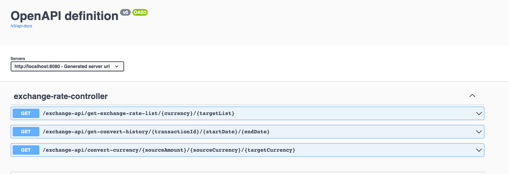

## ExchangeAPI Project
This project consist of simple Currency Converter project that have below features:

- Get Currency Exchange Rates
- Convert Currency
- Viewing the currency exchange rate
- Viewing the currency exchange rate history
- Viewing the currency exchange rate history of specific date

### TOOLS & TECH
- Java 11
- Spring Boot 2.5.6
    - Spring Data MongoDB
    - Spring Data Rest
    - Spring Web
- MongoDB
- Docker
- Mapstruct
- SpringDoc OpenApi
- Lombok
- Maven
- Junit 5, Mockito

### 1.1 How To Install
### Prerequisites !
##### 1. You should have installed docker. https://www.docker.com/products/docker-desktop
##### 2. You should have minimum Java 11 version and Maven CLI.

first clone or download project then

`cd currency_converter-main`

### 1.2 How to Run
Run **runProject.sh** file in root directory

    > chmod +x runProject.sh 
    
    > ./runProject.sh

*You don't need to install mongodb separately, docker file contains mongodb image, and it can set required settings as well.

Run tests
```
$ cd currency_converter-main
$ mvn test
```

## 1.3 Usage  

#### Sample Requests:  #####
http://localhost:8080/exchange-api/get-exchange-rate-list/TRY/EUR,USD,BRL

http://localhost:8080/exchange-api/convert-currency/12/EUR/TRY,USD,BRL

http://localhost:8080/exchange-api/get-conversion-history?startDate=2022-07-09T00:01:00.00&endDate=2022-07-08T23:59:00.00
http://localhost:8080/exchange-api/get-conversion-history?transactionId=5e9f8f8f-9f8f-9f8f-9f8f-9f8f8f8f8f8f


#### Swagger (You can also test api via swagger in browser)
http://localhost:8080/swagger-ui/index.html?configUrl=/v3/api-docs/swagger-config#/


